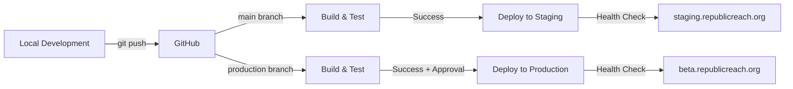

# RepublicReach's Infrastructure
Informal build notes at the bottom.

> A data engineering platform that unifies fragmented U.S. congressional data into a coherent, queryable system.

[](LICENSE)

## Overview

RepublicReach transforms diverse government data sources—APIs, XML feeds, and static files into a normalized PostgreSQL database. Serving unified congressional information through a modern and web application. The platform provides citizens with easy access to their representatives, current legislation, and district information through an intuitive interface. The transformed data also lays the foundation for agentic LLM analysis through structured and rich metadata. 

**Live at:** [beta.republicreach.org](https://beta.republicreach.org)

## Architecture

```
todo uml here
```

## Key Features

### Data Unification
- **Diverse Source Integration**: Consolidates data from (Congress.gov API)[https://api.congress.gov/], (XML bulk downloads)[https://www.govinfo.gov/bulkdata], Wikidata SPARQL queries, and scraped district office information 
- **Normalized Schema**: Unified data model for members, bills, sponsorships, districts, and offices
- **Temporal Data Handling**: Tracks congressional sessions, actions, term dates, and legislative history
- **Geospatial Integration**: Local PostGIS-powered (district boundaries)[https://redistrictingdatahub.org/dataset/118th-congressional-districts-nov-2022-election-active-jan-2023-jan-2025/] with spatial queries

### ETL Pipeline Architecture
- **Modular Design**: Independent pipelines for different data sources
- **Orchestrated Execution**: Dependency resolution and parallel processing
- **Error Recovery**: Comprehensive error handling with retry logic
- **Incremental Updates**: Efficient change detection for API data
- **Bulk Operations**: Optimized PostgreSQL upserts for large datasets

### Web Application
- **Interactive District Map**: Click-to-select congressional districts with representative information
- **Representative Directory**: Searchable database of all current members of Congress
- **Legislative Tracking**: Browse and search bills with sponsorship information
- **State Information**: Integrated state government data and legislature details

## Technology Stack

### Backend
- **Python 3.12**: Core ETL pipeline implementation
- **PostgreSQL 16**: Primary data store with PostGIS extension and PoLP
- **SQLAlchemy**: ORM with sophisticated bulk operations
- **Pydantic**: Configuration and data validation
- **asyncio**: Concurrent pipeline execution
- **Redis/Valkey**: Live populated stream of recent events for home page

### Frontend  
- **SvelteKit**: Full-stack web framework
- **Svelte 5**: Reactive UI with new runes system
- **TypeScript**: Type-safe frontend development
- **MapLibre GL**: Open-source map rendering
- **Tailwind CSS v4**: Utility-first styling

### Infrastructure
- **nginx**: Reverse proxy with SSL termination and caching
  - Production: beta.republicreach.org → localhost:3000
  - Staging: staging.republicreach.org → localhost:4173 (IP restricted)
  - Tile Server: tiles.republicreach.org → localhost:2999 (CORS enabled)
  - Main domain: republicreach.org → redirects to beta
  - Dev: dev.republicreach.org → localhost:5173 (IP restricted) 
- **systemd**: Service orchestration with user-level services
- **Martin**: Vector tile server for map data (hot swapped migrated from pgtileserv)
- **Ubuntu Server**: Production environment
- **Server**: Hetzner VPS with Firewall
- **Deployment Tools**: Automated scripts for environment validation and database sync

## Data Sources

| Source | Type | Update Frequency | Purpose |
|--------|------|------------------|---------|
| (Congress.gov API)[https://api.congress.gov/] | REST API | Daily | Member information, bills, sponsorships |
| (Congressional Bulk Data)[https://www.govinfo.gov/bulkdata] | XML Files | Daily | Complete bill text and metadata |
| Wikidata | SPARQL | Weekly | State government information |
| (GIS Boundaries)[https://redistrictingdatahub.org/dataset/118th-congressional-districts-nov-2022-election-active-jan-2023-jan-2025/] | Shapefiles | Per Congress | District geographic boundaries |
| Static Files | YAML | As needed | District office locations |

## System Components

### ETL Pipeline (`/etl`)
The extract-transform-load system orchestrates data collection from multiple sources:

- **orchestrator.py**: Manages pipeline execution with dependency resolution
- **models/**: SQLAlchemy ORM models defining the unified schema
- **database.py**: Database operations with bulk insert optimization
- **pipelines/**: Individual pipeline implementations for each data source

### Web Application (`/LIBERTY-SITE` - `prod` branch)
#### Web Application Staging (`LIBERTY-SITE-STAGING` - `main` branch)
Modern SvelteKit application serving the unified data:

- **routes/**: Page components for map, representatives, and bills
- **lib/**: Shared components and state management stores
- **API routes**: RESTful endpoints for data access

### Deployment Infrastructure
- **Multi-environment**: Separate staging and production deployments with separate databases
- **SSL/TLS**: Automated certificate management with Let's Encrypt
- **Monitoring**: Application health checks and data freshness tracking
- **Backups**: Automated PostgreSQL backup strategy with point-in-time recovery

## CI/CD Pipeline

### Automated Deployment Flow



### GitHub Actions Workflow

The deployment pipeline automates the entire build and deployment process:

1. **Build & Test Phase**
   - Linting with ESLint
   - Type checking with TypeScript
   - Unit test execution
   - Production build verification

2. **Staging Deployment** (on `main` push)
   - SSH-based deployment to staging server
   - Zero-downtime deployment with build backups
   - Automated health checks
   - Database connection from `.env.staging`

3. **Production Deployment** (on `production` push)
   - Manual approval required
   - Automatic rollback capability
   - Retention of last 5 build backups
   - Database connection from `.env.production`

### Infrastructure Architecture

```
┌─────────────────────────────────────────────────────────────┐
│                    GitHub Actions Runner                     │
│                                                              │
│  Build → Test → Deploy → Health Check → Notification       │
└────────────────────┬────────────────────────────────────────┘
                     │ SSH
┌────────────────────▼────────────────────────────────────────┐
│                    Hetzner VPS Server                        │
│                                                              │
│  ┌─────────────────────────┐  ┌─────────────────────────┐  │
│  │   systemd Services       │  │   nginx Reverse Proxy   │  │
│  │                         │  │                         │  │
│  │  liberty-staging :4173  │  │  staging.domain → 4173  │  │
│  │  liberty-beta    :3000  │  │  beta.domain    → 3000  │  │
│  │  martin         :2999  │  │  tiles.domain   → 2999  │  │
│  └─────────────────────────┘  └─────────────────────────┘  │
│                                                              │
│  ┌─────────────────────────────────────────────────────┐   │
│  │              PostgreSQL 16 + PostGIS                 │   │
│  │                                                      │   │
│  │  Production DB │ Staging DB │ Automated Backups    │   │
│  └─────────────────────────────────────────────────────┘   │
└──────────────────────────────────────────────────────────────┘
```

### Environment Management

| Environment | Branch | URL | Database | Purpose |
|-------------|--------|-----|----------|---------|
| Production | `production` | beta.republicreach.org | `gov` | Live users |
| Staging | `main` | staging.republicreach.org | `gov_staging` | Testing |
| Development | `feature/*` | localhost:5173 | `gov_staging` | Development |

### Security & Monitoring

1. **Security Measures**
   - SSH key-based deployment (no passwords)
   - Environment variables for sensitive data
   - Firewall rules restricting access
   - IP whitelisting for staging environments
   - SSL/TLS on all public endpoints
   - Production database readonly for web application
   - Separate database and users for ETL, staging, and production environments

2. **Health Monitoring**
   - Automated health checks post-deployment
   - systemd service status monitoring
   - nginx access and error logs with goaccess
   - Deployment readiness validation (`deploy/scripts/check-env.sh`)

3. **Backup Strategy**
   - Automated PostgreSQL backups
   - Build artifact retention (last 5 versions)
   - Safe database synchronization (`deploy/scripts/db-sync-safe.sh`)
   - Point-in-time recovery capability

### Deployment Infrastructure

The repository includes complete deployment configuration:

#### `deploy/` - Service Configuration
- **systemd/**: Service definitions for production and staging environments
- **scripts/**: Deployment automation and validation tools
  - `check-env.sh`: Comprehensive deployment readiness checks
  - `db-sync-safe.sh`: Safe database synchronization between environments
- **Setup Documentation**: Step-by-step setup and CI/CD configuration guides

#### `nginx/` - Web Server Configuration
- **SSL/TLS**: All sites use HTTPS with Let's Encrypt certificates
- **Reverse Proxy**: Routes traffic to appropriate Node.js services
- **Security**: IP restriction for staging environment
- **Performance**: Aggressive caching for tile server (1 hour TTL)
- **CORS**: Configured for tile server to support all subdomains

## Performance

The system efficiently processes and serves congressional data:
- Unified access to 535+ representatives
- Normalized storage of 10,000+ bills per session  
- Geospatial queries across 435 congressional districts
- Automated daily updates maintaining data freshness

## Demo Videos

> [Placeholder: ETL pipeline execution demonstration]

> [Placeholder: Web application feature walkthrough]

## Future Enhancements

- Historical data preservation
- Enhanced fuzzy search capabilities
- Mobile application development
- Machine learning pipeline integration potential

## License

MIT License - see [LICENSE](LICENSE) file for details

## Author

Gabriel Trevino

> https://gabe.blog

---

*Built with a focus on data integrity, system reliability, and user accessibility*


--- 

# Build Notes
### braindump

- Built to better unify and democratize [hard to access or buried](https://en.wikipedia.org/wiki/2025_United_States_government_online_resource_removals) information, with an emphasis on a self-hosted, local-first (backend) architecture.

No API rate limiting. Load tests show SQL queries are efficient enough and aggresive caching on API endpoints are sufficient for data ingression rates. May integrate Cloudflare Workers later for caching on the edge. 

Will be simple if I ever get to my planned migration of the API endpoints to be on FastAPI rather than SvelteKit. Decoupling the Rest API to Python will also allow native ORM integration with the ETL pipelines.

Schema changes are frequent in early building, hence staging having its own database. 

Schema Dump (on local dev - postgres user only):
```
 Schema |                   Name                   |   Type   |  Owner
--------+------------------------------------------+----------+----------
 public | bill_actions                             | table    | postgres
 public | bill_actions_id_seq                      | sequence | postgres
 public | bill_amendments                          | table    | postgres
 public | bill_amendments_id_seq                   | sequence | postgres
 public | bill_attestations                        | table    | postgres
 public | bill_attestations_id_seq                 | sequence | postgres
 public | bill_committees                          | table    | postgres
 public | bill_committees_id_seq                   | sequence | postgres
 public | bill_cost_estimates                      | table    | postgres
 public | bill_cost_estimates_id_seq               | sequence | postgres
 public | bill_definitions                         | table    | postgres
 public | bill_definitions_id_seq                  | sequence | postgres
 public | bill_external_references                 | table    | postgres
 public | bill_external_references_id_seq          | sequence | postgres
 public | bill_laws                                | table    | postgres
 public | bill_laws_id_seq                         | sequence | postgres
 public | bill_related                             | table    | postgres
 public | bill_related_id_seq                      | sequence | postgres
 public | bill_sections                            | table    | postgres
 public | bill_sections_id_seq                     | sequence | postgres
 public | bill_subjects                            | table    | postgres
 public | bill_subjects_id_seq                     | sequence | postgres
 public | bill_summaries                           | table    | postgres
 public | bill_summaries_id_seq                    | sequence | postgres
 public | bill_tables                              | table    | postgres
 public | bill_tables_id_seq                       | sequence | postgres
 public | bill_text_content                        | table    | postgres
 public | bill_text_content_id_seq                 | sequence | postgres
 public | bill_text_versions                       | table    | postgres
 public | bill_text_versions_id_seq                | sequence | postgres
 public | bill_titles                              | table    | postgres
 public | bill_titles_id_seq                       | sequence | postgres
 public | bill_toc_entries                         | table    | postgres
 public | bill_toc_entries_id_seq                  | sequence | postgres
 public | bill_votes                               | table    | postgres
 public | bill_votes_id_seq                        | sequence | postgres
 public | bills                                    | table    | postgres
 public | congressional_districts_118_carto        | table    | postgres
 public | congressional_districts_118_carto_id_seq | sequence | postgres
 public | district_offices                         | table    | postgres
 public | etl_logs                                 | table    | postgres
 public | etl_logs_id_seq                          | sequence | postgres
 public | etl_runs                                 | table    | postgres
 public | etl_runs_id_seq                          | sequence | postgres
 public | geography_columns                        | view     | postgres
 public | geometry_columns                         | view     | postgres
 public | members                                  | table    | postgres
 public | members_districts                        | table    | postgres
 public | raw_bill_xml                             | table    | postgres
 public | spatial_ref_sys                          | table    | postgres
 public | sponsorships                             | table    | postgres
 public | sponsorships_id_seq                      | sequence | postgres
 public | state_info                               | table    | postgres
 public | state_info_id_seq                        | sequence | postgres
```

Rich XML metadata for congressional bills enables agentic LLM analysis. Currently building out the Infrastructure to do this at scale. 119-HR-1 for example far exceeds 1M tokens. But embedded table of contents and references to other bills are present. 

This webapp was originally built to be a 5calls-esque website, but evolved to be more high-level oversight focused. But district contact information was still a missing piece of the puzzle as there's no central registry, only a (community maintained YAML db)[https://raw.githubusercontent.com/unitedstates/congress-legislators/refs/heads/main/legislators-district-offices.yaml] that's outdated. See my solution for this at: https://github.com/gtrev500/load_reps_sites. Uses LLMs to extract all district contact infromation with human-in-the loop validation. 

I want to integrate Periodic Transaction Report details into the site as well. This way you can see stock purchases of your congress members easily. PACs too. Deciding wheather to roll my own at scale or use quiverquant or something. PTR data is largely unstructured. See quick & dirty informal demo here: (tiktok demo scraping PTR data)[https://www.tiktok.com/t/ZTj79HfPw/]

Also #TODO make that emberassing deploy gh workflow into bash script

treat .md docs in this repo as guidelines, original scripts were edited and tightened for per-user security.

##### why location tracking on map not yet integrated yet
Location detection on the map is ignored for now. I should get back on that. It's 90% built but you need a disgusting 3-tiered system for accurate location pin pointing. I rather focus on infra/data. When i implement this I want it to be 100% old-folk friendly and 100% accurate.

ie. BigDataCloud (supposedly SOTA?) IP geolocation to location. doesn't give accurate confidence bounds. For confidence bounds it does give you need to crosswalk to district boundaries. if crosses, then you need to get a second 'warmer or colder' from the user to exact the right district. This is decently computationally/SQL expensive - didn't spend a lot of time optimizing it though.
* this is fully implemented and works 100% first-pass for the 3 wifi'd locations I've tried on the West Coast, but cellular not so much. False positives here is no bueno. Confidence bounds aren't reliable. 

OR get geolocation from device API, but that's not universal. 

Asking for ZIP has same implications as geolocation. ZIP codes are USPS proprietary and shapefiles that do exist are not super reliable. Can use same system I already developed for ip geolocation but again, it's not as effecient as I'd like it to be. And I don't know my +4 zip code, so ditch that. 

Asking for full address is annoying and a turn off but I may have to rely on that. Reverse address geocoding I believe can be done fully w/o 3rd party I believe. Maybe others as a first-pass, but again, 3 tiered system - disgusting.
