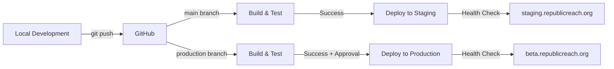

# RepublicReach

> A data engineering platform that unifies fragmented U.S. congressional data into a coherent, queryable system

[](LICENSE)

## Overview

RepublicReach transforms diverse government data sources—APIs, XML feeds, and static files—into a normalized PostgreSQL database, serving unified congressional information through a modern web application. The platform provides citizens with easy access to their representatives, current legislation, and district information through an intuitive interface.

**Live at:** [beta.republicreach.org](https://beta.republicreach.org)

## Architecture

```
┌─────────────────────────────────────────────────────────────┐
│                    External Data Sources                     │
│  Congress.gov API │ XML Feeds │ Wikidata │ District Files  │
└────────────────────┬────────────────────────────────────────┘
                     │
┌────────────────────▼────────────────────────────────────────┐
│                    ETL Pipeline Layer                        │
│                                                              │
│  ┌─────────────┐  ┌──────────────┐  ┌─────────────────┐   │
│  │   Members   │  │ Congress     │  │ District        │   │
│  │   Pipeline  │  │ Data Pipeline│  │ Offices Pipeline│   │
│  └─────────────┘  └──────────────┘  └─────────────────┘   │
│                                                              │
│  ┌──────────────────────┐  ┌────────────────────────────┐  │
│  │  State Info Pipeline │  │   Pipeline Orchestrator   │  │
│  └──────────────────────┘  └────────────────────────────┘  │
└────────────────────┬────────────────────────────────────────┘
                     │
┌────────────────────▼────────────────────────────────────────┐
│                    PostgreSQL + PostGIS                      │
│                                                              │
│  Normalized Schema │ Spatial Data │ Temporal Tracking      │
└────────────────────┬────────────────────────────────────────┘
                     │
┌────────────────────▼────────────────────────────────────────┐
│                 Application Layer (SvelteKit)                │
│                                                              │
│  RESTful API │ Server-Side Rendering │ Type-Safe Routes    │
└────────────────────┬────────────────────────────────────────┘
                     │
┌────────────────────▼────────────────────────────────────────┐
│                    nginx + Caching Layer                     │
│                                                              │
│  tiles.republicreach.org │ beta/staging/production sites   │
└─────────────────────────────────────────────────────────────┘
```

## Key Features

### Data Unification
- **Diverse Source Integration**: Consolidates data from Congress.gov API, XML bulk downloads, Wikidata SPARQL queries, and static district office files
- **Normalized Schema**: Unified data model for members, bills, sponsorships, districts, and offices
- **Temporal Data Handling**: Tracks congressional sessions, term dates, and legislative history
- **Geospatial Integration**: PostGIS-powered district boundaries with spatial queries

### ETL Pipeline Architecture
- **Modular Design**: Independent pipelines for different data sources
- **Orchestrated Execution**: Dependency resolution and parallel processing
- **Error Recovery**: Comprehensive error handling with retry logic
- **Incremental Updates**: Efficient change detection for API data
- **Bulk Operations**: Optimized PostgreSQL upserts for large datasets

### Web Application
- **Interactive District Map**: Click-to-select congressional districts with representative information
- **Representative Directory**: Searchable database of all current members of Congress
- **Legislative Tracking**: Browse and search bills with sponsorship information
- **State Information**: Integrated state government data and legislature details

## Technology Stack

### Backend
- **Python 3.12**: Core ETL pipeline implementation
- **PostgreSQL 16**: Primary data store with PostGIS extension
- **SQLAlchemy**: ORM with sophisticated bulk operations
- **Pydantic**: Configuration and data validation
- **asyncio**: Concurrent pipeline execution

### Frontend  
- **SvelteKit**: Full-stack web framework
- **Svelte 5**: Reactive UI with new runes system
- **TypeScript**: Type-safe frontend development
- **MapLibre GL**: Open-source map rendering
- **Tailwind CSS v4**: Utility-first styling

### Infrastructure
- **nginx**: Reverse proxy with caching
- **systemd**: Service orchestration with user-level services
- **Martin**: Vector tile server for map data (hot swapped from pgtileserv)
- **Ubuntu Server**: Production environment
- **Server**: Hetzner VPS with Firewall
- **Deployment Tools**: Automated scripts for environment validation and database sync

## Data Sources

| Source | Type | Update Frequency | Purpose |
|--------|------|------------------|---------|
| Congress.gov API | REST API | Daily | Member information, bills, sponsorships |
| Congressional Bulk Data | XML Files | Daily | Complete bill text and metadata |
| Wikidata | SPARQL | Weekly | State government information |
| GIS Boundaries | Shapefiles | Per Congress | District geographic boundaries |
| Static Files | YAML | As needed | District office locations |

## System Components

### ETL Pipeline (`/etl`)
The extract-transform-load system orchestrates data collection from multiple sources:

- **orchestrator.py**: Manages pipeline execution with dependency resolution
- **models.py**: SQLAlchemy ORM models defining the unified schema
- **database.py**: Database operations with bulk insert optimization
- **pipelines/**: Individual pipeline implementations for each data source

### Web Application (`/LIBERTY-SITE` - `prod` branch)
#### Web Application Staging (`LIBERTY-SITE-STAGING` - `main` branch)
Modern SvelteKit application serving the unified data:

- **routes/**: Page components for map, representatives, and bills
- **lib/**: Shared components and state management stores
- **API routes**: RESTful endpoints for data access

### Deployment Infrastructure
- **Multi-environment**: Separate beta, staging, and production deployments
- **SSL/TLS**: Automated certificate management with Let's Encrypt
- **Monitoring**: Application health checks and data freshness tracking
- **Backups**: Automated PostgreSQL backup strategy with point-in-time recovery

## CI/CD Pipeline

### Automated Deployment Flow



### GitHub Actions Workflow

The deployment pipeline automates the entire build and deployment process:

1. **Build & Test Phase**
   - Linting with ESLint
   - Type checking with TypeScript
   - Unit test execution
   - Production build verification

2. **Staging Deployment** (on `main` push)
   - SSH-based deployment to staging server
   - Zero-downtime deployment with build backups
   - Automated health checks
   - Database connection from `.env.staging`

3. **Production Deployment** (on `production` push)
   - Manual approval required
   - Blue-green deployment strategy
   - Automatic rollback capability
   - Retention of last 5 build backups

### Infrastructure Architecture

```
┌─────────────────────────────────────────────────────────────┐
│                    GitHub Actions Runner                     │
│                                                              │
│  Build → Test → Deploy → Health Check → Notification       │
└────────────────────┬────────────────────────────────────────┘
                     │ SSH
┌────────────────────▼────────────────────────────────────────┐
│                    Hetzner VPS Server                        │
│                                                              │
│  ┌─────────────────────────┐  ┌─────────────────────────┐  │
│  │   systemd Services       │  │   nginx Reverse Proxy   │  │
│  │                         │  │                         │  │
│  │  liberty-staging :4173  │  │  staging.domain → 4173  │  │
│  │  liberty-beta    :3000  │  │  beta.domain    → 3000  │  │
│  │  martin         :3100  │  │  tiles.domain   → 3100  │  │
│  └─────────────────────────┘  └─────────────────────────┘  │
│                                                              │
│  ┌─────────────────────────────────────────────────────┐   │
│  │              PostgreSQL 16 + PostGIS                 │   │
│  │                                                      │   │
│  │  Production DB │ Staging DB │ Automated Backups    │   │
│  └─────────────────────────────────────────────────────┘   │
└──────────────────────────────────────────────────────────────┘
```

### Environment Management

| Environment | Branch | URL | Database | Purpose |
|-------------|--------|-----|----------|---------|
| Production | `production` | beta.republicreach.org | `gov` | Live users |
| Staging | `main` | staging.republicreach.org | `gov_staging` | Testing |
| Development | feature/* | localhost:5173 | `gov_local` | Development |

### Security & Monitoring

1. **Security Measures**
   - SSH key-based deployment (no passwords)
   - Environment variables for sensitive data
   - Firewall rules restricting access
   - SSL/TLS on all public endpoints

2. **Health Monitoring**
   - Automated health checks post-deployment
   - systemd service status monitoring
   - nginx access and error logs
   - Database connection pooling metrics
   - Deployment readiness validation (`deploy/scripts/check-env.sh`)

3. **Backup Strategy**
   - Automated daily PostgreSQL backups
   - Build artifact retention (last 5 versions)
   - Safe database synchronization (`deploy/scripts/db-sync-safe.sh`)
   - Point-in-time recovery capability

### Deployment Infrastructure

The `deploy/` directory contains production deployment configuration:

- **systemd/**: Service definitions for production and staging environments
- **scripts/**: Deployment automation and validation tools
  - `check-env.sh`: Comprehensive deployment readiness checks
  - `db-sync-safe.sh`: Safe database synchronization between environments
- **Setup Documentation**: Step-by-step setup and CI/CD configuration guides

## Installation

> [Placeholder: Detailed setup instructions to be added]

## Development

> [Placeholder: Development workflow and contribution guidelines]

## Performance

The system efficiently processes and serves congressional data:
- Unified access to 535+ representatives
- Normalized storage of 10,000+ bills per session  
- Geospatial queries across 435 congressional districts
- Automated daily updates maintaining data freshness

## Demo Videos

> [Placeholder: ETL pipeline execution demonstration]

> [Placeholder: Web application feature walkthrough]

## Future Enhancements

- API rate limiting and authentication
- Historical data preservation
- Enhanced search capabilities
- Mobile application development
- Machine learning pipeline integration potential

## License

MIT License - see [LICENSE](LICENSE) file for details

## Author

Gabriel Trevino

> [Placeholder: Personal website/contact information]

---

*Built with a focus on data integrity, system reliability, and user accessibility*
